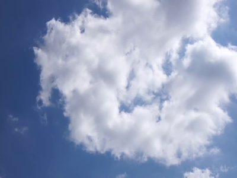

# Cloud Detection & Tracking using the Visual Colour Space: Concept Exploration

## Proposal

Quick yet accurate Weather prediction is imperative for certain industries to now only survive,
but simply exist. An important factor of these is the ability to track, categorize and predict
movements of clouds within a given area. Ceilometers use a laser/light source to determine a
cloud's base or ceiling height. A Ceilometer usually can also measure aerosol concentration in
air [1]. The downside is that ceilometers have a relatively small area of measurement directly
above the unit which would not be an issue, however, as of 2020 they can cost around USD
$30 000 per unit [3].
There exists however, high quality satellite data made available by NASA. The new MISR Level
2 Cloud product contains height-resolved, cloud motion vectors at 17.6 km resolution; cloud top
heights at 1.1 km resolution; and cross-track cloud motion components at 1.1 km resolution [2].
Now this data is made available to be used by software engineers to visualize as needed. The
issue? This data is not meant for real-time application on a local area level. These products are
made for global application, collecting data only on the sunlit side of earth over the course of 9
days [4].
A better solution for the local-area level must be thought of then, to better predict cloud
movement and category.

The formal proposal made to VLSP can be viewed in the [Proposal](proposal.pdf)

## Main Issues

The main issues with the implementation of this concept are:
1. Camera fidelity
2. Weather sensor Accuracy

The following is an exploration of this concept with a focus on the camera module. 

## Setup

An Esp32 with an OV2460 DVP camera module is pointed at the sky at a location and predetermined angle (prefereably perpendicular). A pycom board connects to a web server started on the esp32 and retrieves the image. The pycom board takes a number of measurements of the surroundings including the humidity, temperature, dew point and estimated cloud height. This information, along with the image is then sent back to a server listening for the pycom device.
Due to the amorphous and feature-sparse nature of Clouds, tracking them via conventional image processing techniques such as via contours, frame-to-frame motion tracking and identifiable features allowing for conventional NN training, they are surprisingly difficult to autonomously track frame-to-frame.
However, accurately tracking clouds may be as simple as identifying them via a statistical analysis of their colour values across multiple colour spaces. While object detection and identification is done via feature detection, usually on highly downscaled greyscale images,
I believe identification of clouds could come down to BGR and HSV values.
With the cloud base height, location and frame to frame motion of a cloud available to us, we can more accurately assign velocity vectors to cloud structures, along with the area of effect for their shadows on the ground.

## Usage

Usage can be broken down into the three components of the project, the:
- FiPy board (with pysense expansion board)
- ESP32 camera board
- Home Windows server.

### ESP32 Camera Board

All files meant to be on the esp32 board are within the [esp32 folder](esp32/). [clear_lib](esp32/clear_lib.py) and [update_lib](esp32/update_lib.py) are simple scripts meant to clear and update the on-board lib folder respectively. The [main](esp32/main.py) simply calls [serve_image](esp32/serve_image.py). [serve_image](esp32/serve_image.py) activates turns on the on-board wifi and listens on port 80 for a request to connect. Once connected, it takes a picture and sends it to the connected socket.

### FiPy w/ Pysense Board

All files meant to be on the FiPy board are within the [pycom folder](pycom/). [clear_lib](pycom/clear_lib.py) and [update_lib](pycom/update_lib.py) are simple scripts meant to clear and update the on-board lib folder respectively.The [main](pycom/main.py) simply calls the cycle function within [image_transfer](pycom/image_transfer.py). This runs a cycle of attempting to connect to the esp32 board, request an image, take readings and finally send the image to the desktop server on a different WiFi network.

### Listener Server

The [Listener.py](listener.py) script contains a simple web socket, listening for connections on port 88.The server in this case is given a static IP for simplicity. Once a connection is made, the image and readings in CSV format are received. Readings and images are saved in folders labeled by date.

## Analysis

In the classification/separation of sky from cloud regions using two sets of three colour channels, 

### Image Quality Requirements

While colour space based operations are fairly easy on high quality images, the OV2460 is not high quality. Contrast is low, over/under-exposure are almost ensured and ISO changes are not only drastic but cause unwanted light filtering and other strange behaviour. In all, while the camera is not exactly suited for this application, it is what is available and what I was able to test with. The shortcomings become apparent below.

### Colourspace Frequency Histogram

First is graphing the frequencies of the BGR and HSV values for clouds versus the sky surrounding them. This is done in [colour_graphs](colour_graphs.py).
Each reference image in [Reference-Images](Reference-Images/) has a corresponding image in [Blocked-Images](Blocked-Images/).

The Blocked out images are coloured such that clouds are coloured red and the sky is coloured black. Small borders around clouds are left as to not capture the noise of whispy cloud edges.
This is used to create two binary images and subsequent masked images of the reference image, one for the clouds and one for the sky in the scene. These are split, iterated over and their colour values recorded. These values are then graphed and can viewed below.
NOTE: The divisons in the bar graphs is an artifact from saving the graphs as pngs, as the pdf versions do not contain these.

#### Frequency Chart for High Res Images
 

These show the frequency graphs for the colour channels of the 60 images of the sky, separated into regions of sky and cloud.

Above we that viusally, the distributions for these images could be approximated to normal distributions if properly cleaned, especially that of the clouds.
It is also apparent that the Red and Green colour space would be more useful in the pursuit to classify data.

Above we see that for the most part, only the 
Value channel would be useful for separation/classification, but that the separation between them is more prominent than in other colour channels.

#### Frequency Chart for ESP Images
 

These show the frequency graphs for the colour channels of the 20 images of the sky taken with the OV2640, separated into regions of sky and cloud. 

Above we see that while the pattern of separation in the channels in followed, the lack of colour fidelity causes the sky regions to a more bimodal distribution. This can be seen in images where the sky looks more purple than blue, or regions of it are under/overexposed, or subject to strange tinting.

Above we see that the hue looks somewhat similar, the saturation and value are nothing like the higher resolution images. I attribute this to the camera querks mentioned before. The value distribution for both clouds and sky regions is completely different now, with the sky region peaking at 100, rather than closer to 150 and skewing right.

### ScreePlot
 

Once the percentage variance of each colour channel in differentiating cloud and sky pixels is found, these can be visualized as a ScreePlot. This is done within [pca_graphs](pca_graphs.py).

#### ScreePlot for High Res Images
 

These show the screeplots for the colour channels of the 60 higher resolution images of the sky, colour channels separated as principle components to check the variance percentage in differentiating sky versus cloud pixels.

Above we see that the red channel accounts for ~80% of the variance in the cloud vs sky regions, with the green channel accounting for just under 20%. This means that in classification, the red and green channels are the main factors. We could then discard  

Above we see that the Value channel as expected leads in variance, though the next two channels are closer than one might think when looking at the distribution graphs. Still, the variance of the Value channel alone is almost as much as the other two channels combined (~50%). 

#### ScreePlots for ESPImages
 

These show the screeplots for the colour channels of the 20 images of the sky taken with the OV2640, colour channels separated as principle components to check the variance percentage in differentiating sky versus cloud pixels.

Above we see that the screeplot for the BGR channels is similar to that of that higher resolution images, despite the lack of image fidelity.

Above we see that there is an even smaller difference between the respective channels, meaning that using them to differentiate the two data sets is more difficult. The channel variance percents do however follow the expected scale.

### PCA ScatterPlot
 

Once a matrix of principle components (colour channels) and their per variance values is obtained, these can be visulaized in a PCA Plot. The DataFrame of all pixels is split into two (cloud pixel variance and sky pixel variance dataframes respectively) to allow for better labelling. The two highest variance PCs are then graphed onto a Principle component scatterplot of sky versus cloud pixels. This is the second part of [pca_graphs](pca_graphs.py).

#### PCA ScatterPlot for High Res Images
 

#### PCA ScatterPlot for ESP Images
 

## References

[1] The National Oceanic and Atmospheric Administration. 16 November 2012. p. 60.

[2] K. Mueller, M. Garay, C. Moroney, V. Jovanovic (2012). MISR 17.6 KM GRIDDED CLOUD
MOTION VECTORS: OVERVIEW AND ASSESSMENT, Jet Propulsion Laboratory, 4800 Oak
Grove, Pasadena, California.

[3] F .Rocadenbosch, R. Barragán , S.J. Frasier ,J. Waldinger, D.D. Turner , R.L. Tanamachi,
D.T. Dawson (2020) Ceilometer-Based Rain-Rate Estimation: A Case-Study Comparison With
S-Band Radar and Disdrometer Retrievals in the Context of VORTEX-SE

[4] “Misr: Spatial resolution,” NASA, https://misr.jpl.nasa.gov/mission/misr-instrument/spatial-
resolution/ (accessed May 19, 2023).

[5] “tlcl_rh_bolton,” Tlcl_rh_bolton,
https://www.ncl.ucar.edu/Document/Functions/Contributed/tlcl_rh_bolton.shtml (accessed May
21, 2023)

[6] Muñoz, Erith & Mundaray, Rafael & Falcon, Nelson. (2015). A Simplified Analytical Method
to Calculate the Lifting Condensation Level from a Skew-T Log-P Chart. Avances en Ciencias e
Ingenieria. 7. C124-C129

[7] Wmo, “Cumulonimbus,” International Cloud Atlas, https://cloudatlas.wmo.int/en/observation-
of-clouds-from-aircraft-descriptions-cumulonimbus.html (accessed May 21, 2023)
