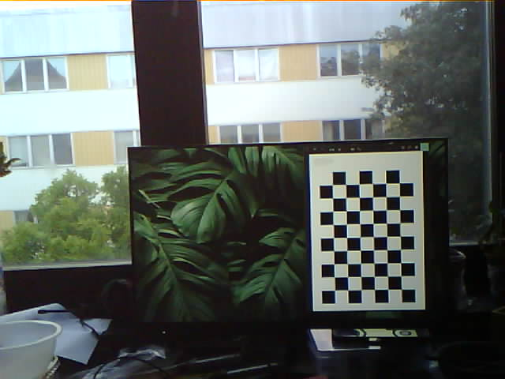
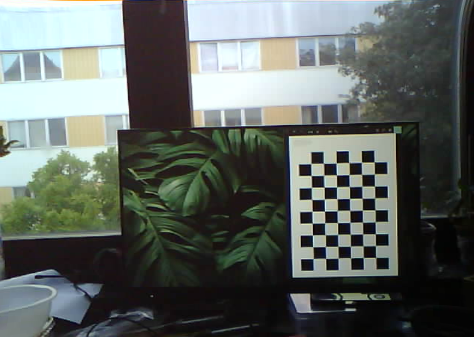

# Cloud Detection: Concept Exploration

## Idea and inspiration

The ability to track clouds currently is prohibitively expensive and inaccurate for many human needs.
"The MISR (Multi-angle Imaging SpectroRadiometer) instrument on the Terra satellite has been
retrieving cloud motion vectors (CMVs) globally... in February 2012 the new MISR Level 2 Cloud product was publicly released, providing cloud motion vectors at 17.6 km resolution" [[1]](https://www-cdn.eumetsat.int/files/2020-04/pdf_conf_p60_s6_03_mueller_v.pdf). This resolution, speed of data access and prohibitive cost of current ground-based tools for cloud tracking result in no clear solutions for those who may need this data.

The formal proposal made to VLSP can be viewed in the [Proposal](proposal.pdf)

### "What this is"

This is a proof of concept for the ability to distinguish and accurately track Clouds using a fixed position esp32 camera, with processing done at a central server ie: a Windows desktop.
In the current program state, the cloud base height can be recorded, however, the following proves the capability for simple image processing techniques to be used to track cloud movement, size and shadow cast onto the ground.

### Concept

An esp32 with an OV2460 I2C camera module is pointed at the sky at a location and predetermined angle (prefereably perpendicular). A pycom board connects to a web server started on the esp32 and retrieves the image. The pycom board takes a number of measurements of the surroundings including the humidity, temperature, dew point and estimated cloud height. This information, along with the image is then sent back to a server listening for the pycom device.
Due to the amorphous and feature-sparse nature of Clouds, tracking them via conventional image processing techniques such as via contours, frame-to-frame motion tracking and identifiable features allowing for conventional NN training, they are surprisingly difficult to autonomously track frame-to-frame.
However, accurately tracking clouds may be as simple as identifying them via a statistical analysis of their colour values across multiple colour spaces. While object detection and identification is done via feature detection, usually on highly downscaled greyscale images,
I believe identification of clouds could come down to BGR and HSV values.
With the cloud base height, location and frame to frame motion of a cloud available to us, we can more accurately assign velocity vectors to cloud structures, along with the area of effect for their shadows on the ground.

### Issues

1. I had originally planned to take the readings from a BME280 temperature and humidity sensor, however, due to driver issues and my lack of a soldering iron, I opted instead to get the readings from the pysense module of a pycom fipy module.
2. Originally the pycom device was supposed to transfer the files to the desktop via LTE, however the person from who I got the specific sim card needed, failed to activate it in the time I needed it for, causing me to opt instead to using WIFI for the purposes of testing.
3. Due to the nature of these changes, things such as power profiling and data cost analysis can't be done yet for this specific system.

## Usage

Usage can be broken down into the three components of the project, the:
- FiPy board (with pysense expansion board)
- ESP32 camera board
- Home Windows seerver.

### ESP32 Camera Board

All files meant to be on the esp32 board are within the [esp32 folder](esp32/). [clear_lib](esp32/clear_lib.py) and [update_lib](esp32/update_lib.py) are simple scripts meant to clear and update the on-board lib folder respectively. The [main](esp32/main.py) simply calls [serve_image](esp32/serve_image.py). [serve_image](esp32/serve_image.py) activates turns on the on-board wifi and listens on port 80 for a request to connect. Once connected, it takes a picture and sends it to the connected socket.

### FiPy w/ Pysense Board

All files meant to be on the FiPy board are within the [pycom folder](pycom/). [clear_lib](pycom/clear_lib.py) and [update_lib](pycom/update_lib.py) are simple scripts meant to clear and update the on-board lib folder respectively.The [main](pycom/main.py) simply calls the cycle function within [image_transfer](pycom/image_transfer.py). This runs a cycle of attempting to connect to the esp32 board, request an image, take readings and finally send the image to the desktop server on a different WiFi network.

### Listener Server

The [Listener.py](listener.py) script contains a simple web socket, listening for connections on port 88. Once a connection is made, the image and readings in csv form are received. Readings and images are saved in folders labeled by date.

## Cloud Size Estimation

The main crux of this project is the estimation of a cloud's size after it's pixel area has been selected. This is difficult with most camera's, as every camera has some intrinsic distortion, making accurate estimation of size and distance difficult. However, it is possible to calibrate our camera and undistort images captured with it. Since the angle of the camera is known to us (preferably 90), along with the approximate cloud base height, and the field of view of the camera, it is then possible to give an estimation of the total area of the cloud. This would also allow us, knowing the distance the cloud would travel across two frames at that particular height, to then assign a velocity vector to a cloud.

### Cloud base height calculation

A simple cloud height for most cumulus and cumulo-nimbus clouds can be found via:

1. Calculating the difference between the current temperature and the dew point.
2. Divide the result by 2.5 for measurements in Celsius (4.4 for Farenheit) then multiply by 1000 to get the cloud base in feet above the current measurement point.
3. Multiply this result by 0.3048 to get the cloud base height in feet from the current height.

### Camera Calibration

In simple terms, all cameras have intrinsic and extrinsic characteristics which induce image distortion. These can be expressed as matrices. Once found, we can induce a distortion matrix, and thusly, an image matrix to be applied to images to undo distortion. This is done via the openCV library and involves finding the position of known, measured object points in our distorted image and finding the transformations done to obtain our known measurements. In my case these are found in [calibration images](/calibration_images/), the code from which is mostly [from Nicolai Høirup Nielsen](https://github.com/niconielsen32) in his [ComputerVision](https://github.com/niconielsen32/ComputerVision) repository. An example below shows an example image and its undistorted form.

This undstorted image can now be used for the mapping of 3D objects of known dimensions.

## Analysis

### Image Quality Requirements

While colour space based operations are fairly easy on high quality images, the OV2460 is not high quality. Contrast is low, over/under-exposure are almost ensured and ISO changes are not only drastic but cause unwanted light filtering and other strange behaviour. In all, while the camera is not exactly suited for this application, it is what is available and what I was able to test with. The shortcomings become apparent below.

### Colorspace Frequency Histogram

First is graphing the frequencies of the bgr and hsv values for clouds versus the sky surrounding them. This is done in [colour_graphs](colour_graphs.py).
Each reference image in [Reference-Images](Reference-Images/) has a corresponding image in [Blocked-Images](Blocked-Images/). The Blocked out images are coloured such that clouds are coloured red and the sky is coloured black. Small borders around clouds are left as to not capture the noise of whispy cloud edges.
This is used to create two binary images and subsequent masked images of the reference image, one for the clouds and one for the sky in the scene. These are split, iterated over and their colour values recorded. These values are then graphed and can viewed below.
NOTE: The divisons in the bar graphs is an artifact from saving the graphs as pngs, as the pdf versions do not contain these.

#### Frequency Chart for High Res Images

#### Frequency Chart for ESP Images

### ScreePlot

Once the percentage variance of each colour channel in differentiating cloud and sky pixels is found, these can be visualized as a ScreePlot.
It can be seen with the context of the above graphs that in the case of BGR images, the order of the Principle components is Red, Green and Blue respectively.

#### ScreePlots for High Res Images

#### ScreePlots for ESPImages

### PCA ScaatterPlot

Once a matrix (Pandas DataFrame) of principle components (colour channels) and their per variance values is obtained, these can be visulaized in a PCA Plot. The DataFrame of all pixels is split into two [cloud pixel variance and sky pixel variance dataframes respectively] to allow for better labelling.

#### PCA ScatterPlot for High Res Images

#### PCA ScatterPlot for ESP Images

## Results
The OV2460 lacks the required color fidelity to reliably be used for a our purposes. The expected results of the higher quality camera systems show clear separations in the red colour channel along with the Value in the HSV colour space. The OV2460 camera shows results with somewhat similar principle component variances, but still lacks the quality and software control to be used in real world application of this task.

## References

[[1]](https://www-cdn.eumetsat.int/files/2020-04/pdf_conf_p60_s6_03_mueller_v.pdf) K. Mueller, M. Garay, C. Moroney, V. Jovanovic (2012). MISR 17.6 KM GRIDDED CLOUD MOTION VECTORS: OVERVIEW
AND ASSESSMENT, Jet Propulsion Laboratory, 4800 Oak Grove, Pasadena, California. [available here.](https://www-cdn.eumetsat.int/files/2020-04/pdf_conf_p60_s6_03_mueller_v.pdf)
