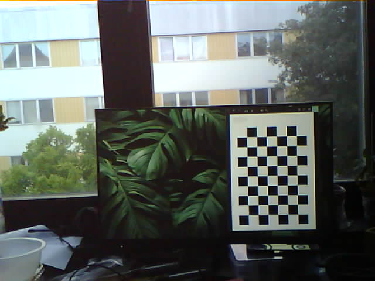
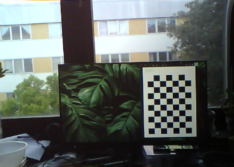

# Cloud Detection & Tracking using the Visual Colour Space: Concept Exploration

## Concept

Quick yet accurate Weather prediction is imperative for certain industries to now only survive,
but simply exist. An important factor of these is the ability to track, categorize and predict
movements of clouds within a given area. Ceilometers use a laser/light source to determine a
cloud's base or ceiling height. A Ceilometer usually can also measure aerosol concentration in
air [1]. The downside is that ceilometers have a relatively small area of measurement directly
above the unit which would not be an issue, however, as of 2020 they can cost around USD
$30 000 per unit [3].
There exists however, high quality satellite data made available by NASA. The new MISR Level
2 Cloud product contains height-resolved, cloud motion vectors at 17.6 km resolution; cloud top
heights at 1.1 km resolution; and cross-track cloud motion components at 1.1 km resolution [2].
Now this data is made available to be used by software engineers to visualize as needed. The
issue? This data is not meant for real-time application on a local area level. These products are
made for global application, collecting data only on the sunlit side of earth over the course of 9
days [4].
A better solution for the local-area level must be thought of then, to better predict cloud
movement and category.

The formal proposal made to VLSP can be viewed in the [Proposal](proposal.pdf)

## Setup

An esp32 with an OV2460 I2C camera module is pointed at the sky at a location and predetermined angle (prefereably perpendicular). A pycom board connects to a web server started on the esp32 and retrieves the image. The pycom board takes a number of measurements of the surroundings including the humidity, temperature, dew point and estimated cloud height. This information, along with the image is then sent back to a server listening for the pycom device.
Due to the amorphous and feature-sparse nature of Clouds, tracking them via conventional image processing techniques such as via contours, frame-to-frame motion tracking and identifiable features allowing for conventional NN training, they are surprisingly difficult to autonomously track frame-to-frame.
However, accurately tracking clouds may be as simple as identifying them via a statistical analysis of their colour values across multiple colour spaces. While object detection and identification is done via feature detection, usually on highly downscaled greyscale images,
I believe identification of clouds could come down to BGR and HSV values.
With the cloud base height, location and frame to frame motion of a cloud available to us, we can more accurately assign velocity vectors to cloud structures, along with the area of effect for their shadows on the ground.

## Usage

Usage can be broken down into the three components of the project, the:
- FiPy board (with pysense expansion board)
- ESP32 camera board
- Home Windows seerver.

### ESP32 Camera Board

All files meant to be on the esp32 board are within the [esp32 folder](esp32/). [clear_lib](esp32/clear_lib.py) and [update_lib](esp32/update_lib.py) are simple scripts meant to clear and update the on-board lib folder respectively. The [main](esp32/main.py) simply calls [serve_image](esp32/serve_image.py). [serve_image](esp32/serve_image.py) activates turns on the on-board wifi and listens on port 80 for a request to connect. Once connected, it takes a picture and sends it to the connected socket.

### FiPy w/ Pysense Board

All files meant to be on the FiPy board are within the [pycom folder](pycom/). [clear_lib](pycom/clear_lib.py) and [update_lib](pycom/update_lib.py) are simple scripts meant to clear and update the on-board lib folder respectively.The [main](pycom/main.py) simply calls the cycle function within [image_transfer](pycom/image_transfer.py). This runs a cycle of attempting to connect to the esp32 board, request an image, take readings and finally send the image to the desktop server on a different WiFi network.

### Listener Server

The [Listener.py](listener.py) script contains a simple web socket, listening for connections on port 88. Once a connection is made, the image and readings in csv form are received. Readings and images are saved in folders labeled by date.

## Cloud Size Estimation

The main crux of this project is the estimation of a cloud's size after it's pixel area has been selected. This is difficult with most camera's, as every camera has some intrinsic distortion, making accurate estimation of size and distance difficult. However, it is possible to calibrate our camera and undistort images captured with it. Since the angle of the camera is known to us (preferably 90), along with the approximate cloud base height, and the field of view of the camera, it is then possible to give an estimation of the total area of the cloud. This would also allow us, knowing the distance the cloud would travel across two frames at that particular height, to then assign a velocity vector to a cloud.

### Cloud base height calculation

An important factor for cloud monitoring is obtaining the cloud base height. The cloud base is
the lowest point of the visible portion of a cloud, usually expressed in meters above sea
level/planet surface. This can be calculated in close estimation by finding the lifted condensate
level. The lifted condensation level or lifting condensation level (LCL) is formally defined as the
height or pressure at which the relative humidity (RH) of an air parcel will reach 100% with
respect to liquid water when it is cooled by dry adiabatic lifting. [5] The LCL can be
approximated using the dew point,humidity and temperature a few different ways. The most
popular being Espy's equation, which has been shown to be satisfactory for accurate readings
within 200m [6].

A more simple cloud height for most cumulus and cumulo-nimbus clouds can be found via:

1. Calculating the difference between the current temperature and the dew point.
2. Divide the result by 2.5 for measurements in Celsius (4.4 for Farenheit) then multiply by 1000 to get the cloud base in feet above the current measurement point.
3. Multiply this result by 0.3048 to get the cloud base height in feet from the current height.

### Camera Calibration

In simple terms, all cameras have intrinsic and extrinsic characteristics which induce image distortion. These can be expressed as matrices. Once found, we can induce a distortion matrix, and thusly, an image matrix to be applied to images to undo distortion. This is done via the openCV library and involves finding the position of known, measured object points in our distorted image and finding the transformations done to obtain our known measurements. In my case these are found in [calibration images](/calibration_images/), the code from which is mostly [from Nicolai Høirup Nielsen](https://github.com/niconielsen32) in his [ComputerVision](https://github.com/niconielsen32/ComputerVision) repository. An example below shows an example image and its undistorted form.

This undstorted image can now be used for the mapping of 3D objects of known dimensions.

If another lens was added such as a dome to the camera module, an extrinsic matrix for the lensing of that dome would be needed but trivial to adjust for.

## References

[1] The National Oceanic and Atmospheric Administration. 16 November 2012. p. 60.

[2] K. Mueller, M. Garay, C. Moroney, V. Jovanovic (2012). MISR 17.6 KM GRIDDED CLOUD
MOTION VECTORS: OVERVIEW AND ASSESSMENT, Jet Propulsion Laboratory, 4800 Oak
Grove, Pasadena, California.

[3] F .Rocadenbosch, R. Barragán , S.J. Frasier ,J. Waldinger, D.D. Turner , R.L. Tanamachi,
D.T. Dawson (2020) Ceilometer-Based Rain-Rate Estimation: A Case-Study Comparison With
S-Band Radar and Disdrometer Retrievals in the Context of VORTEX-SE

[4] “Misr: Spatial resolution,” NASA, https://misr.jpl.nasa.gov/mission/misr-instrument/spatial-
resolution/ (accessed May 19, 2023).

[5] “tlcl_rh_bolton,” Tlcl_rh_bolton,
https://www.ncl.ucar.edu/Document/Functions/Contributed/tlcl_rh_bolton.shtml (accessed May
21, 2023)

[6] Muñoz, Erith & Mundaray, Rafael & Falcon, Nelson. (2015). A Simplified Analytical Method
to Calculate the Lifting Condensation Level from a Skew-T Log-P Chart. Avances en Ciencias e
Ingenieria. 7. C124-C129

[7] Wmo, “Cumulonimbus,” International Cloud Atlas, https://cloudatlas.wmo.int/en/observation-
of-clouds-from-aircraft-descriptions-cumulonimbus.html (accessed May 21, 2023)